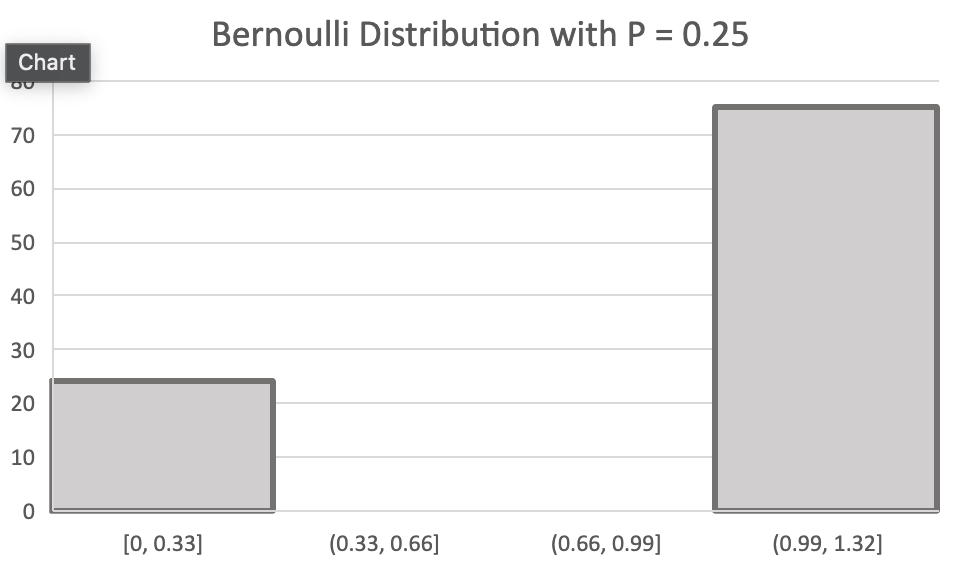
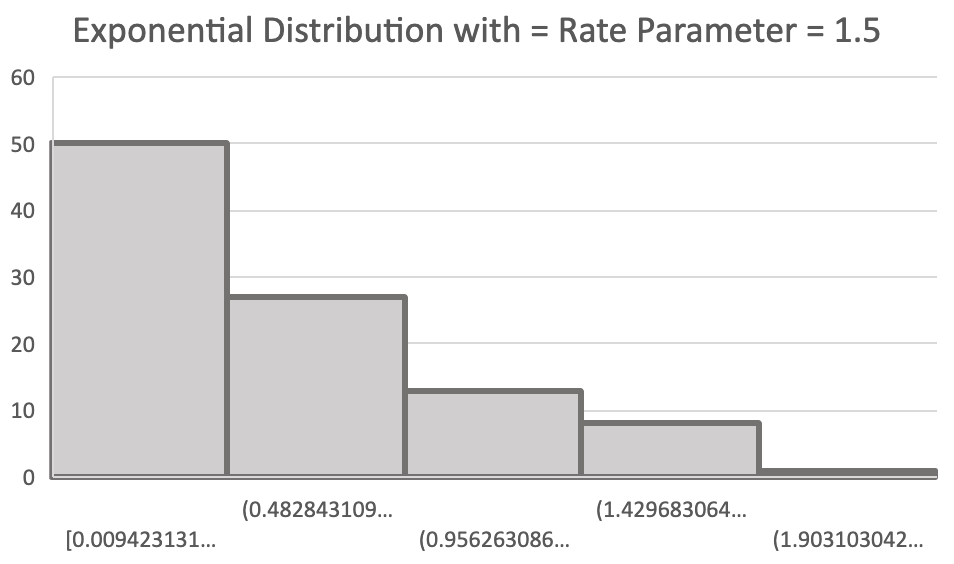
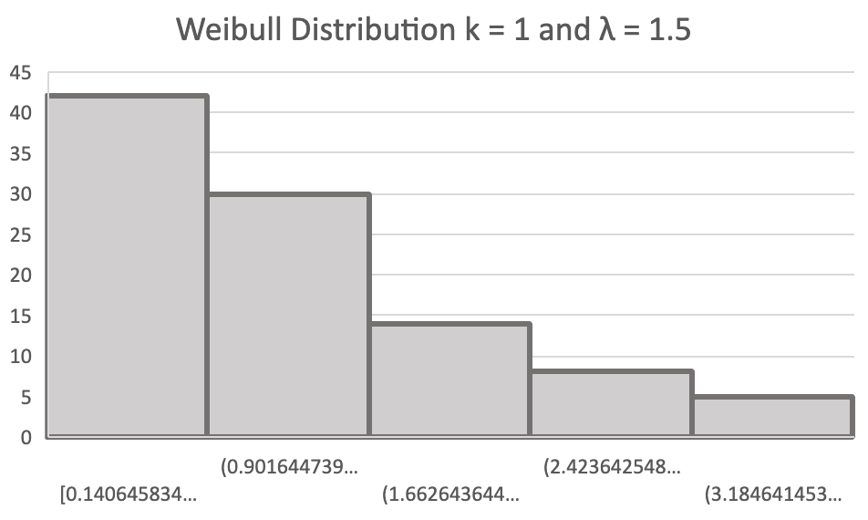
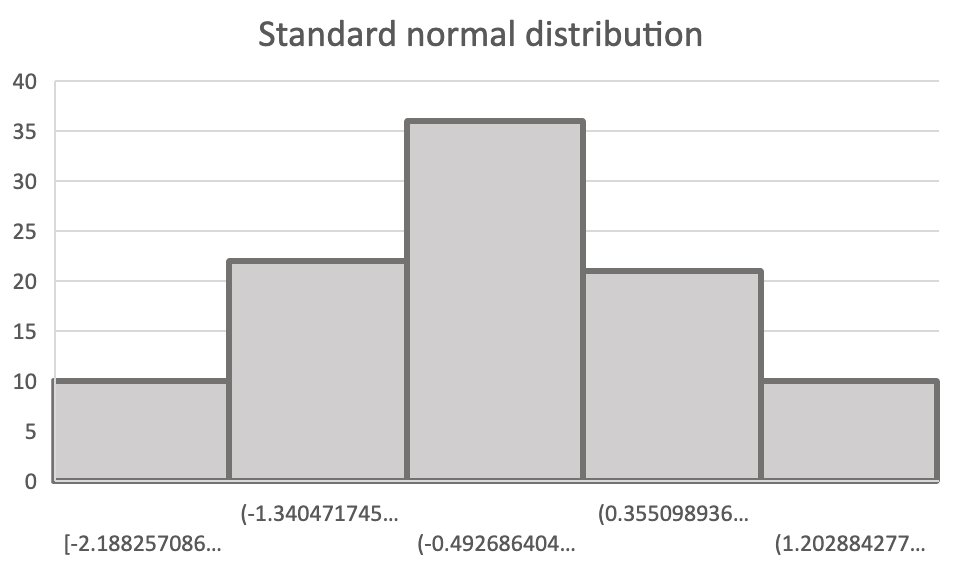

# distributions
 Library routines for generating random variates from all of the usual discrete and continuous distributions, e.g., Bern(p), Geom(p), Exp(λ) ...

This series of random number generators allows you to create random numbers that fit discrete and continuous distributions from a Unif(0,1) random number.

Go tests have been written against the Mean and Variance of the distributions and the documentation below will show the histograms from samples of random numbers returned by the random number generation functions.

# Using this library

To use this library just `go get` this repository and use the following functions to start generating random numbers.

_________________
## Bernoulli

Bernoulli takes a probability of p and returns a 1 or 0 based on the formula above.



```
Pr(X=1)=p=1 
Pr(X=0)=1-q
```

The function takes a float64, probability as a parameter. The function will return an error if the probability value is _less than_ 0 OR _greater than_ 1.

```
probability := 0.25
number, err := Bernoulli(probability)
```

### Mean
`E(X) = p`

### Variance
`Var[X] = pq = p(1-p)`
_________________
## Exponential

The Exponential function generates random numbers from a Unif(0,1) random number so that the returned value fits an exponential distribution given a rate parameter which is a float64. 

```
rate_parameter := 1.5
n, _ := Exp(rp)
```



### Mean 
`E[X] = 1 / λ` 

### Variance
`Var(X) = 1 / λ^2`
_________________
## Weibull


_________________
## Standard Normal



### Mean 
`E[X] = μ`

### Variance
`Var(X) = σ^2`